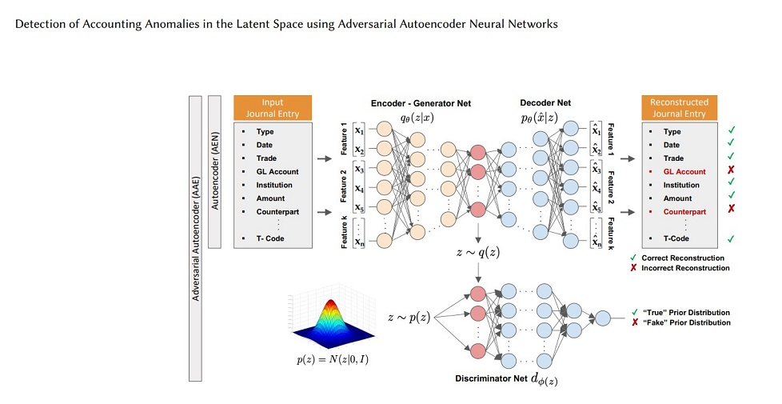
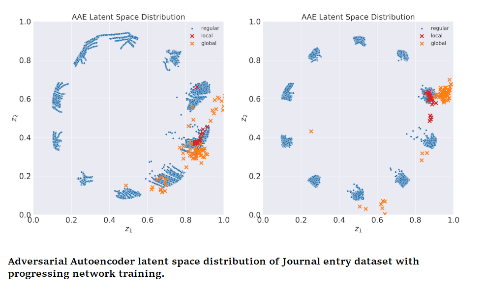
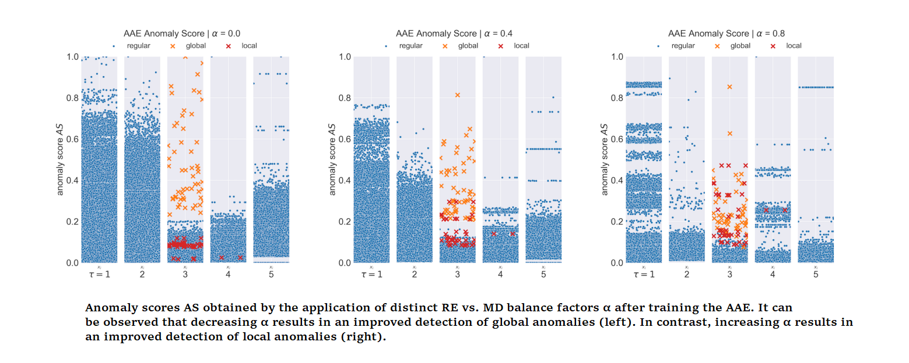

# Detection of Accounting Anomalies using Adversarial Autoencoder Deep Neural Networks for Forensic Audit
## Objective
This repository contains the implementation of a deep learning model that detects accounting anomalies in the latent space using adversarial autoencoder neural networks. 

The detection of fraud in accounting data is a long-standing challenge in financial statement audits. Nowadays, the majority of applied techniques refer to handcrafted rules derived from known fraud scenarios. While fairly successful, these rules exhibit the drawback that they often fail to generalize beyond known fraud scenarios and fraudsters gradually find ways to circumvent them. In contrast, more advanced approaches inspired by the recent success of deep learning often lack seamless interpretability of the detected results. To overcome this challenge, researcher proposed the application of adversarial autoencoder networks. This repository demonstrate that such artificial neural networks are capable of learning a semantic meaningful representation of real-world journal entries. The learned
representation provides a holistic view on a given set of journal
entries and significantly improves the interpretability of detected
accounting anomalies. 

It shows that such a representation combined with the networks reconstruction error can be utilized as
an unsupervised and highly adaptive anomaly assessment.The adversarial component of the model helps to ensure that the anomalies are not simply artifacts of the data reduction.

# Requirements
- Python 3.6 or higher
- Tensorflow 2.0 or higher
- Numpy
- Pandas
- Matplotlib
# Usage
 1. Clone the repository to your local machine:
     
     git clone https://https://github.com/dilip982/financial_fraud_detection.git
 2. Install the required packages:
 
 3. Copy code
    pip install -r requirements.txt
 4. Run the Jupyter Notebook:

    jupyter notebook AccountingAnomalyDetection.ipynb
# Results
The results show that the AAE is capable
of learning a semantic partition of a given set of journal entries
according to that disentangles the entries underlying generative
processes. The learned partition provides the auditor a holistic view
on a given set of accounting data subject to audit. Furthermore,
it allows to effectively obtain a representative and interpretable
sample of the data and thereby reduces the audits sampling risk.

Further, the results lead us to conclude that the proposed
anomaly score can be utilized as a highly adaptive anomaly assessment of financial accounting data. It furthermore provides the
ability to interpret the detected anomalies of a particular mode in
the context of the modes regular journal entry semantics.

# Conclusion
This model provides a powerful tool for detecting accounting anomalies in large financial datasets. By leveraging the ability of deep learning to learn complex relationships in data, the model is able to identify anomalies that might otherwise be missed by traditional methods. The adversarial component of the model helps to ensure that the anomalies are not simply artifacts of the data reduction, making the results more robust and reliable.

